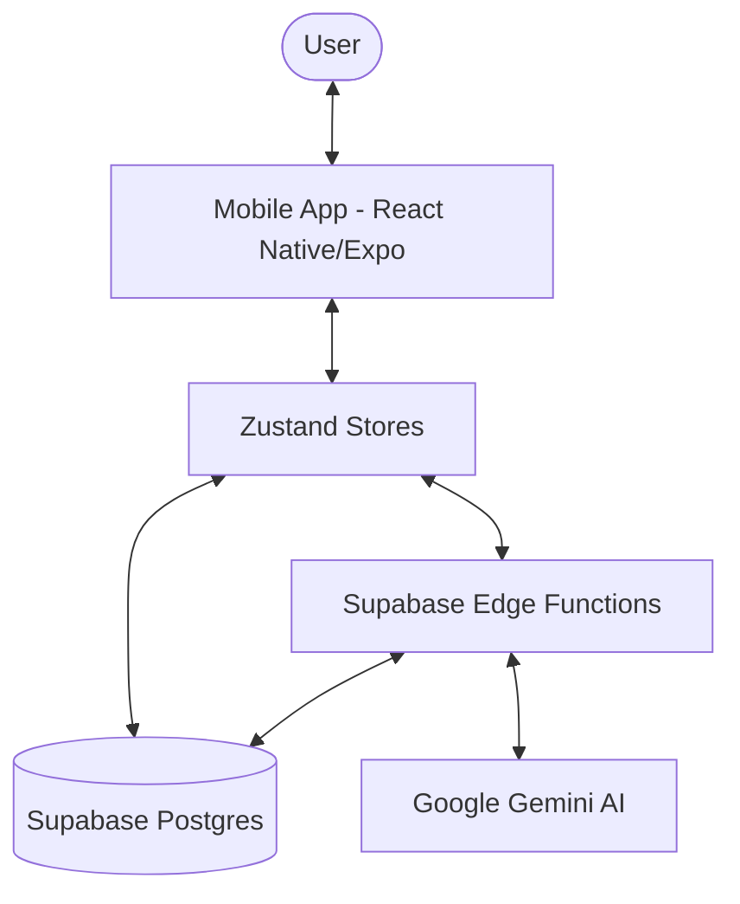

# Vital Quest - Memory Bank

## Project Overview
- **Purpose**: AI-powered health and fitness coach that gamifies wellness. It turns healthy actions into an RPG-like experience with XP, levels, and streaks.
- **Target platforms**: Mobile (iOS & Android) via Expo/React Native.
- **Key constraints**:
    - AI interaction must be context-aware (uses User Memory RAG).
    - Goal-based progression (Weekly/Daily plans).
    - Safety-first AI (Weight loss limits, health-only focus).

## Tech Stack
- **Frameworks**: React Native (Expo SDK 54), Expo Router.
- **Libraries**:
    - **UI**: NativeWind v4 (Tailwind CSS), `@expo/vector-icons`, `lottie-react-native`.
    - **State**: Zustand (`goalsStore`, `authStore`, `gamificationStore`).
    - **Backend**: Supabase (Postgres, Auth, Edge Functions, Storage).
    - **AI**: Google Gemini (via Supabase Edge Functions).
- **Tooling**: TypeScript, EAS (Expo Application Services).

## Project Architecture

### Component Diagram

### Architectural Patterns
- **AI-as-Controller**: The `chat-agent` Edge Function acts as the brain, processing user input, retrieving memory, validating goals, and generating structured plans.
- **RAG (Retrieval-Augmented Generation)**: Uses `user_memory` table with pgvector embeddings to provide personalized context to the AI.
- **Gamification Engine**: Logic spread across `gamificationStore.ts` and database triggers/RLS policies to ensure XP and levels are calculated correctly.
- **Lazy Task Generation**: Daily tasks are generated on-demand or pre-calculated during the "Goal Intake" phase to minimize real-time latency.

## Folder Architecture
- `app/`: Expo Router routes.
    - `(tabs)/`: Main navigation (Home, Plans, Coach, Insights).
    - `(auth)/`: Authentication flow (Login, Signup, Onboarding).
- `components/`: Pure UI components and feature-specific widgets (e.g., `DailyPlanWidget`, `GoalProgressWidget`).
- `stores/`: Zustand stores for shared application state.
- `services/`: Singleton clients (e.g., `supabase.ts`).
- `supabase/`: 
    - `functions/`: Edge Functions logic (`chat-agent`).
    - `migrations/`: Postgres schema and RLS policies.
- `utils/`: Common helper functions (e.g., `CustomAlert`).
- `hooks/`: Custom React hooks (e.g., `useProtectedRoute`).
- `assets/`: Lottie animations, fonts, and static images.
- `docs/`: Project documentation and implementation plans.

## State & Data Flow
- **State management**: Zustand stores handle local persistence and sync with Supabase.
- **API/service layer**: `supabase.ts` provides the communication layer. Edge Functions handle heavy lift AI logic.
- **Local storage**: `AsyncStorage` used via Supabase client and potentially Zustand persistence.
- **Data Flow**:
    1. User interacts with UI (Widgets/Chat).
    2. Store updates local state (optimistic where applicable).
    3. Store calls Supabase (DB or Edge Function).
    4. AI (`chat-agent`) processes request using `user_memory` (RAG) and returns structured JSON or text.
    5. Store updates state with result; UI refreshes.
- **Error handling**: `alertStore` + `CustomAlertModal` for consistent UI feedback.

## Database Schema
- `profiles`: User information, XP, Level, and Bio.
- `health_goals`: Active and past goals (e.g., weight loss).
- `weekly_plans`: Higher-level roadmaps for goals.
- `daily_plans`: Container for daily tasks and AI summaries.
- `plan_tasks`: Individual tasks (workout, nutrition, mindfulness).
- `user_memory`: Vector-enabled table for preserving personal facts.
- `chat_sessions` & `chat_messages`: Conversation persistence.

## Navigation / Routing
- **Library**: Expo Router (v6).
- **Route hierarchy**:
    - `/` (Redirects to `(tabs)/index` or `(auth)/login`).
    - `(tabs)/`: Root of the authenticated experience.
    - `(auth)/`: Routes for unauthenticated users.
    - `profile.tsx`, `settings.tsx`: Top-level screens.
    - `modal.tsx`: Global modal route.
- **Deep linking**: Supported via `expo-linking` (configured in `app.json`).

## Styling System
- **Method**: NativeWind v4 (Tailwind CSS).
- **Theme handling**: Dark mode support via `nativewind`. Standard colors referenced in `global.css` and occasionally hardcoded (Google-inspired palette: Blue #4285F4, Green #34A853).
- **Responsive strategy**: Flexbox-based layouts; Safe areas managed via `react-native-safe-area-context`. Desktop/Web responsiveness handled in `app/_layout.tsx` with max-width containers.

## Code Conventions
- **File naming**: PascalCase for components (`ChatBubble.tsx`), camelCase for stores/utils (`goalsStore.ts`).
- **Component patterns**: Functional components with TypeScript interfaces for props. Use of `SafeAreaView` as root container.
- **Hooks usage**: Stores consumed via `useXStore()`. Custom hooks for logic reuse (e.g., `useProtectedRoute`).
- **Error/logging patterns**: Try-catch blocks in store actions; `console.error` for debugging; `Alert` for user notification.

## Critical Files
- **Entry point**: `app/_layout.tsx` (Root providers, auth initialization).
- **Configuration**: `app.json`, `package.json`, `supabase/config.toml`.
- **Core Stores**: `stores/goalsStore.ts` (Business logic), `stores/authStore.ts` (Identity).
- **AI Core**: `supabase/functions/chat-agent/index.ts`.
- **Environment**: `.env` (Supabase keys).
- **Do-not-touch**: `supabase/migrations/` (unless creating new migration), `node_modules/`.
